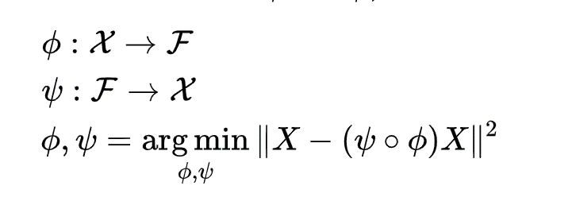

# DeepAutoEncoder

公式如下:

這是一個非監督式的學習，我希望我的input跟ouput越像越好，雖然結構簡單，但卻應用在很多領域，像是NLP領域，常常會把每一個字用OneHotEncoding https://medium.com/@yehjames/%E8%B3%87%E6%96%99%E5%88%86%E6%9E%90-%E6%A9%9F%E5%99%A8%E5%AD%B8%E7%BF%92-%E7%AC%AC2-4%E8%AC%9B-%E8%B3%87%E6%96%99%E5%89%8D%E8%99%95%E7%90%86-missing-data-one-hot-encoding-feature-scaling-3b70a7839b4a
做編碼，可是這樣常常遇到一個問題是，字實在太多了，導致你編碼出來的長度超高，而且這還是一個稀疏矩陣，很多都是0存放沒有效率，所以用這個auto encoder可以將重要的資訊用encoder層存起來，可以大幅的降低對字串encoding的成本，目前IBM就有提供一個api就是他們自己train了一個auto encoder，然後把大量的詞彙做encoder，然後把API釋放出來給大家做使用。

### 結果
Data set: Mnist(經過 10000 steps)
 
paper: https://www.sciencedirect.com/science/article/pii/S0925231214003658?via%3Dihub
