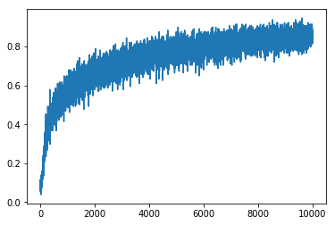
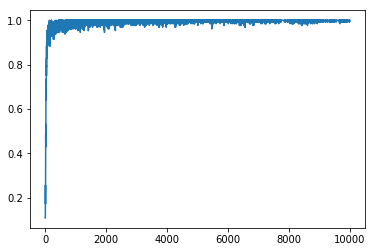
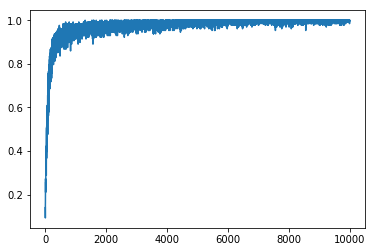
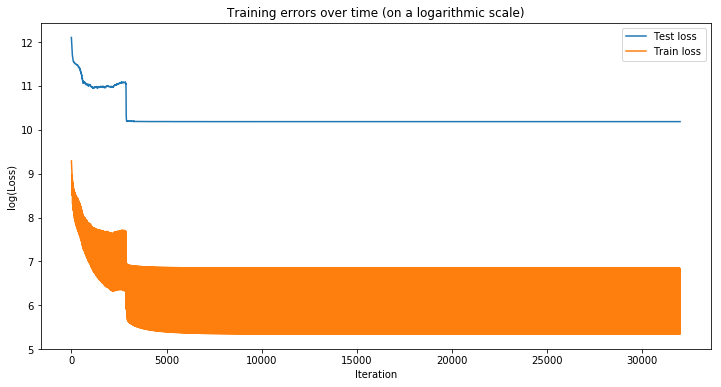
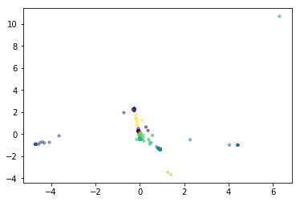
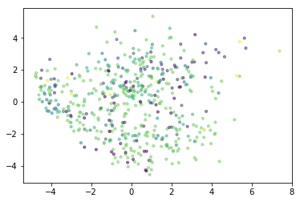

# machine-learning-paper-review


## enviroment


```
tensorflow 1.1.0 
```

## dataset


```
Mnist
```

## Usage
假設你想要跑 bidirectionRNN
```
$ cd bidirectionRNN
```
```
$ python model.py
```
## accurency base
### bidirectionRNN
#### 概念:
bidirection RNN 與一般的 RNN 不太一樣，他是新建兩個不一樣的 RNN，然後去將時序型的資料以相反的方向輸入，以達到前後考慮的特性。

好處：
* 因為前後考慮，所以可以很有效地把時序的效果帶出來
* 不會只依賴前面時序的資料
* 適合使用在詞彙的填空

缺點：
* 方向性的特質被消失了，某些資料是有先後順序的異議的(如股票)
* 訓練成本是一般RNN的兩倍
* 不適合圖片的訓練，沒法有效的抓到特徵

收斂相比下面的 model 效果挺不好的，加上振幅很大，代表說他學習的時候並沒有很快地抓到特徵，也沒辦法做到很好的泛化效果。



### crnn

crnn 就是把 convolution 的 feature 放入 rnn 做訓練，其中 cnn 跟 rnn 的結構都可以有不一樣的變化，我使用的結構是兩層 cnn 兩層 pooling + bidirection RNN完成。

好處：
* 有效的抓到圖片的特徵
* 特別針對有順序的圖片(ex 照片上的地址 由左至右)

缺點：
* 不適合非圖片的資料，因為非圖片的資料通常並沒有很大數量的feature
* 卷積去取 feature 很有可能 loss 太多 information

試過的 nn solution 中收斂最快，且振幅很小，代表他抓到特徵的速度很快，也有較高的泛化能力。



### google net
google net 是一個 residual network，一個非常大的神經網路，google net是由許多 google cell 組成，google cell 是由若干個 卷積跟池化層所組成。

好處：
* 有效的抓到圖片的特徵
* 幾乎不用考慮卷積的 hyperparmeter

缺點：
* 訓練成本非常高
* 卷積去取 feature 很有可能 loss 太多 information
* 非常不適合用於時序型資料

介於 crnn 跟 bidirection 表現之間，有著不錯的收斂速度與泛化能力，但是都沒有 crnn 表現得來的優秀。

<br>
### Random Forest

Random Forest的基本原理是，結合多顆CART樹（CART樹為使用GINI算法的決策樹），並加入隨機分配的訓練資料，以大幅增進最終的運算結果。

好處：
* 訓練快速
* feature 數量並不會影響其效能
* 準確率高

缺點：
* 線性的機器學習模型，無法擬和非常複雜的模型
* 不能做非監督式類型的東西
* 特徵工程要先做好，不然很難學習

random forest 是很一群決策樹叢集，所以收斂的非常快，也不太會有 nn 收斂時震盪的問題，當然這是因為他本身的參數小，可能樹的數量多一點就會有震盪的問題。


### Residual neural network

深度學習可以有效的 fit 非常複雜的系統，但是有一個問題是當模型深度過深的時候常常會梯度消失，為此 Residual neural network 要解決的就是這個問題。

他解決的方式是利用把中間 filter 產生的結果加到後面的輸出中，使其就算發生梯度消失的問題也可以保有原本的輸入值，不會使後面的連接層全部梯度消失。

好處：
* 不太容易有梯度消失問題
* 容易擬和函數
* 準確率高

缺點：
* 容易 overfitting
* 模型龐大，難以訓練

效果意外沒有比傳統的 其他 cnn base 的 model 來的好，不過也許可以把 residual 的概念用在譬如說 crnn 中，也許會有不錯的效果。

<br>
## loss base (unsurpirvise learning)

### DeepAutoencoder

deep auto encoder 是一個透過深度學習技術模擬的一個 encoder 可以把比像是 PCA 等演算法更有效的壓縮資訊。

可以看出來，test 的 loss 跟 train 的 loss 有一大段差距，這是因為資料是圖片的關係，所以導致學習的時候沒有抓到特徵，若圖片的資料應該要使用 cnn base 的 deep auto encoder。



### SpectralNet

Siamese network就是“連體的神經網絡”，神經網絡的“連體”是通過共享權值來實現的。衡量兩個輸入的相似程度。孿生神經網絡有兩個輸入（Input1 and Input2）,將兩個輸入feed進入兩個神經網絡（Network1 and Network2），這兩個神經網絡分別將輸入映射到新的空間，形成輸入在新的空間中的表示。通過Loss的計算，評價兩個輸入的相似度。

下圖是經過 SpectralNet 壓縮後，在經過 K-mean 分群的結果



下圖是經過 PCA 降維後，在經過 K-mean 分群的結果



效果來說，比單純的 PCA 降維好多了，至少大部分同一種類都有正確的分到鄰近的點，而不是像pca降維的的結果基本上就是亂數分類。

### seq2Seq
seq2seq 是一個 encoder 先看過所有的資訊之後，然後把資訊表達成一段一段 vector，然後再透過 decoder 去解碼去擬合一段資料的深度學習方法。

擬合的挺不錯，不過這仍是非監督式學習的seq2seq，監督式學習下的成果仍未知。


