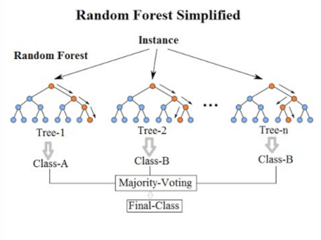
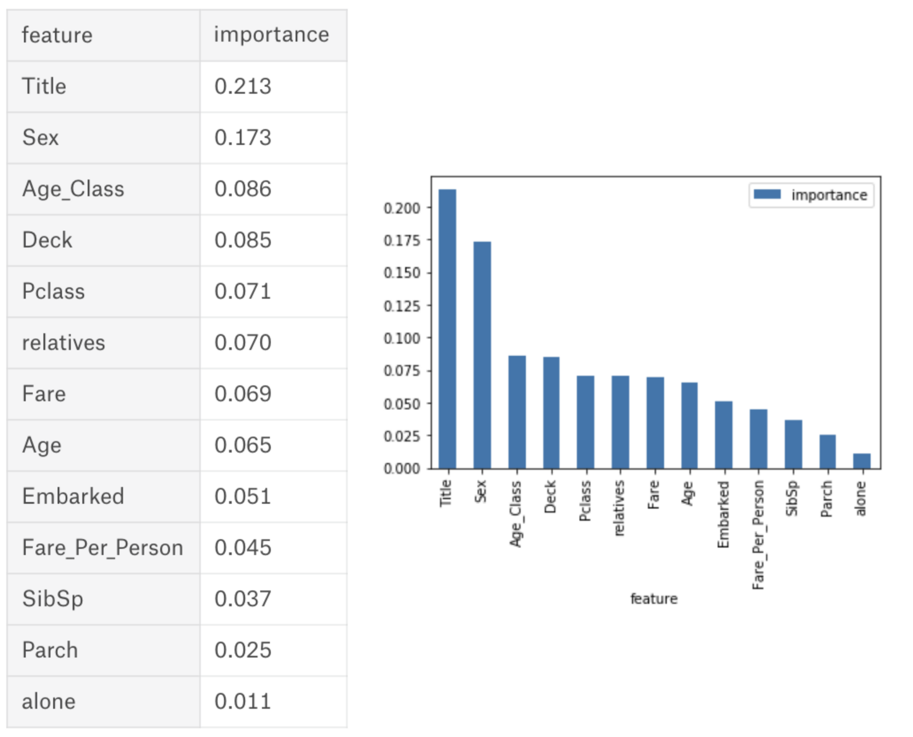

# Random Forests

何謂Random Forest
        Random Forest的基本原理是，結合多顆CART樹（CART樹為使用GINI算法的決策樹），並加入隨機分配的訓練資料，以大幅增進最終的運算結果。不過，這個方法必須基於下面的理論：Ensemble Method

Ensemble Method（集成方法）的想法是，如果單個分類器表現OK，那麼將多個分類器組合起來，其表現會優於單個分類器。也就是論基於「人多力量大，三個臭皮匠勝過一個諸葛亮。」

* 各個分類器之間須具有差異性。
* 每個分類器的準確度必須大於0.5。

必須符合這兩個條件，才能讓結合多顆CART樹的隨機森林其效力大於單一的決策樹，這種方式稱為Ensemble Method（集成方法）。不過由於我們的樣本只有一個，所以要形成多顆具差異性的樹以進行Ensemble Method，必須先將訓練樣本進行分化，才能產生多顆具差異性的CART樹，其作法有兩種方式：

Bagging

這是1996年由Breiman提出（Bagging是Bootstrap aggregating的縮寫），透過Bagging，可讓我們的模型從資料本身的差異中得到更好的訓練。此種方法會從Training dataset中取出K個樣本，再從這K個樣本訓練出K個分類器（在此為tree）。每次取出的K個樣本皆會再放回母體，因此這個K個樣本之間會有部份資料重複，不過由於每顆樹的樣本還是不同，因此訓練出的分類器（樹）之間是具有差異性的。

[以上參考](https://chtseng.wordpress.com/2017/02/24/%E9%9A%A8%E6%A9%9F%E6%A3%AE%E6%9E%97random-forest/)

random forests 最好的好處是他可以針對每一個feature給出重要度評分，根據其重要度，可以有個概念是在假設feature跟結果有其線性關係的情況下，可以找出比較重要的feature並把他交付其他的模型作為feature。

 [來自](https://towardsdatascience.com/the-random-forest-algorithm-d457d499ffcd)