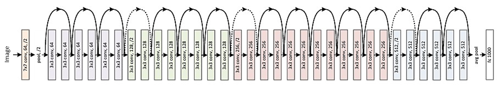
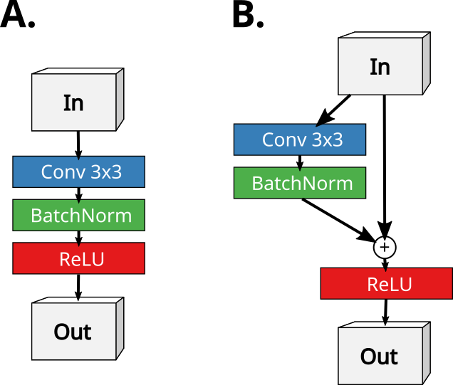

# Residual neural network
### 1. 論文模型架構圖
其結構如下: 
 

### 2. 架構特性與概念 
深度學習可以有效的fit非常複雜的系統，但是有一個問題是當模型深度過深的時候常常會梯度消失，為此Residual neural network要解決的就是這個問題。 
他解決的方式是利用把中間filter產生的結果加到後面的輸出中，使其就算發生梯度消失的問題也可以保有原本的輸入值，不會使後面的連接層全部梯度消失。
### 3. 數學
對每個stack of layers 使用 Residual Learning 的方法如圖所示。在本文中，形式正式每一個block定義為： 
 
 
這裡x和y是所考慮的input layer 的 input 和 output vector。 函數F（x,{Wi}）表示要 learning 的 Residual projection。 以圖中為例，就是一個兩層的結構，F =W2σ（W1x），其中以σ作為表示。 
為了簡化符號，省略了ReLU 和bias的操作F + x由方式執行 connection 和 element add。 採用加法後的第二個非線性（即σ（y））。
#### Equation 
 
這種連接方式既不引入額外 parameters 也不引入多的 complexity 。 這不僅僅是在implement中有吸引力，在比較中也很重要。 
DNN 和 Residual neural network 之間。 可以公平地比較同時擁有的DNN/Residual neural network相同數量的參數，深度，寬度和計算成本（除了可忽略的元素加法）。(但是公式中x和F的尺寸必須相等。如果不是這種情況（例如，在改變輸入/輸出時）Channels），可以用 Ws 的 linear projection。  
但論文中的實驗表明，ideal projection ()就足夠了，其他種投射方式效果並沒有比較好。 
#### 但如果F只有一層， 
因為他會類似於線性層 。
是沒意義的。 
雖然上述是以 DNN 為例子是為了簡單起見，但它們也適用於卷積層。 函數F（x，{Wi}）可以表示多個卷積層。 每個元素的加法是在兩個 Feature maps上每個 channels 執行的。
#### Residual neural network 如何解決梯度消失
因為當w(x)+b 趨近於零時，仍然可以透過+x這個操作讓他不至於梯度消失。
 
參考自deeplearning.ai
### 4. 模型運算邏輯
左邊是普通的cnn 右邊是 Residual neural network 版本的cnn，簡單來說就是把Convlution前的結果+回到output
 
 
主要要注意的點是假設你的input跟output的filter數量不一樣的時候 
ex input 17x17x3 的圖片經過convlution 可能變成 17x17x32，這時候要怎麼做相加，她處理的方式也不困難，就是把原本17x17x3中間缺少的14個 0 filter補齊，然後與原本的input concat 然後再把input跟output相加。
### 5. 閱讀後認為可以發展的方向或心得
Residual neural network雖然有程度的解決梯度消失的問題，但是因為網路通常很深，運算起來的速度實在很慢。

## reference
paper: https://arxiv.org/abs/1512.03385 
tensorflow sample code
