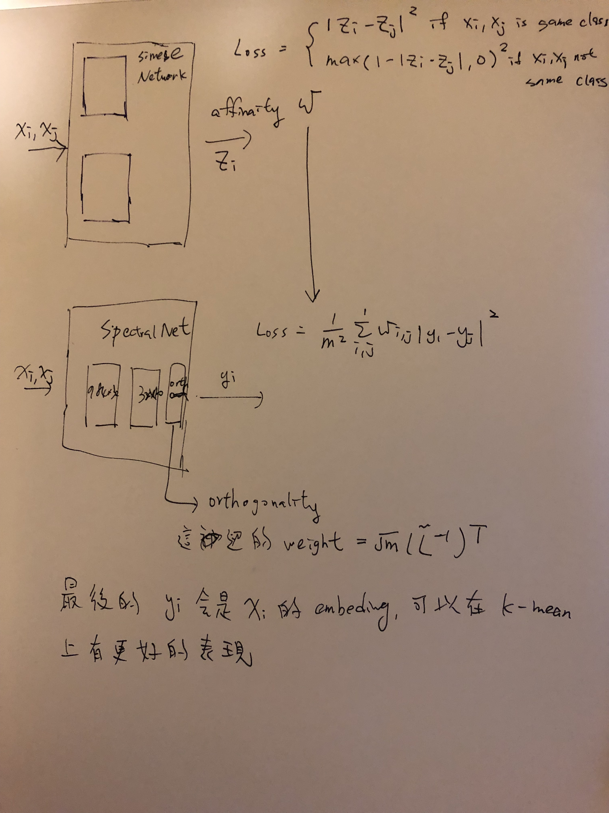
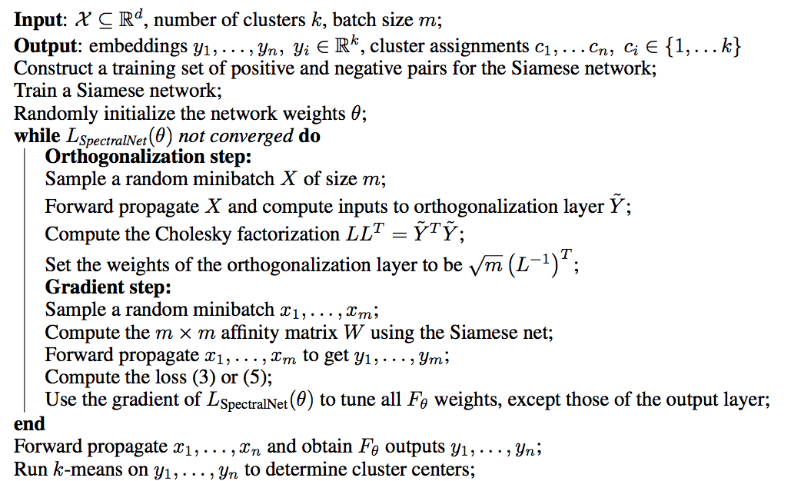
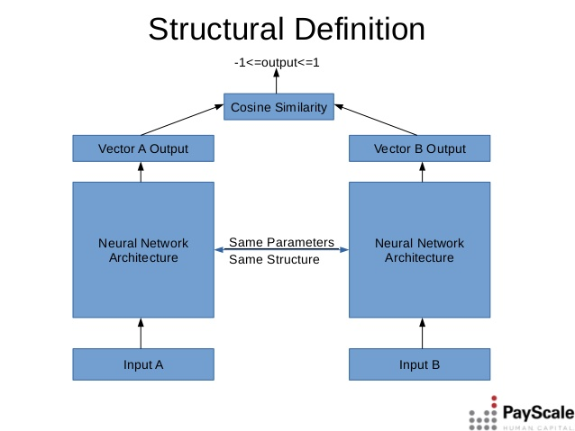
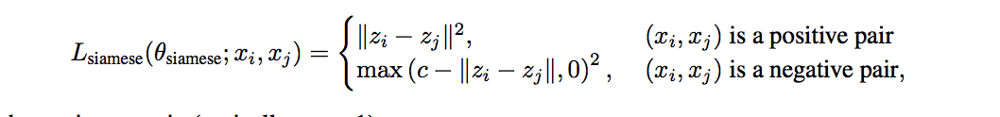
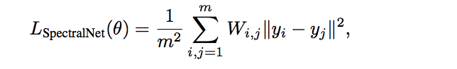
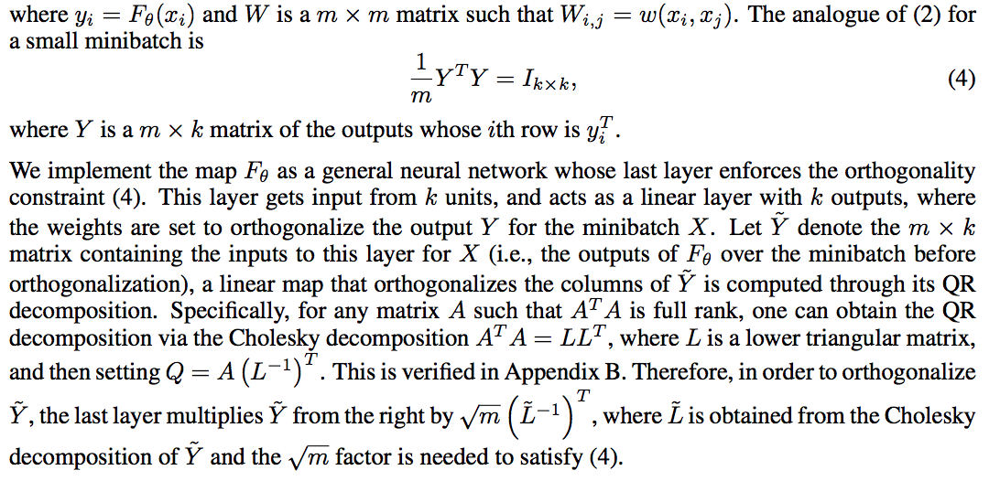

# SpectralNet
### 1. 論文模型架構圖
其結構如下:<br>
<br>

### 2. 架構特性與概念<br>
使用k-mean直接做分群，往往不會有很好的效果，但也許我們手中有一些data可以先讓機器了解一部分的資訊，因此我們會希望可以再透過一個network把這群資料投射到一個其他維度的空間向量，而這個空間向量是相對於目前的空間向量對於k-mean來說是比較好分群的<br>
小結：半監督式的模型，可以讓資料分得更開，比較好做分群。
### 3. 模型運算邏輯
<br>
#### 什麼叫siamese network？
簡單來說，Siamese network就是“連體的神經網絡”，神經網絡的“連體”是通過共享權值來實現的。衡量兩個輸入的相似程度。孿生神經網絡有兩個輸入（Input1 and Input2）,將兩個輸入feed進入兩個神經網絡（Network1 and Network2），這兩個神經網絡分別將輸入映射到新的空間，形成輸入在新的空間中的表示。通過Loss的計算，評價兩個輸入的相似度。
#### 什麼叫訓練一個siamese network？
先透過小量有label的資料去訓練一個siamese network在把它輸出的向量當成是一個權重，這個權重代表的是兩個vector的相似度，我們可以先用小量有label的資料，去兩兩學習這個網路。
<br>
<br>
訓練完這個網路以後，每次給定兩個vector就可以得到這個兩個vector所代表的一個相似度了。
#### 訓練一個 SpectralNet
這個網路也是透過一些層得到最終的一串embeding，我們可以先來看這個loss function
<br>
這個loss function實際上就是透過兩個embeding的距離乘上他的相似度權重，去計算出他們的一個相似程度，去懲罰那些在siamese network認為他們相似度很遠的人，
因為Ｗ這個權重參數可以理解成越大則代表這兩組人差越多。
這邊要多講一個orthonalitiy的問題，因為yi-yj這東西，他會有一個最佳解，就是只要每個向量不管怎樣進去投射的向量都一樣就可以得到loss = 0的最佳解，因此我們要強迫每一組投射出來的y要正交。要做到這件事，則可以透QR分解，在最後一層加上分解後的權重，即可以每一組投射出來的向量正交。詳細內如容下<br>
<br>
##### 模型參數(並不是論文是這樣的結構，這個屬於自己假設的)
```
siameseNetwork 由兩層DNN所構成
  Dense (784,32,acitvation = relu)
  Dense (32,10,acitvation = none)
SpectralNetwork 由兩層DNN所構成
  Dense (784,32,acitvation = relu)
  Dense (32,10,acitvation = sotfmax)
```
### 4.實際結果demo
#### 這是經過mnist訓練後SpectralNet經過PCA降維並使用k-mean分群的結果<br>
<br>
#### 這是直接將minst經過PCA降維並使用k-mean分群的結果<br>
<br>
因為一個半監督的模型，他沒有絕對的準確度可以作為一個評估效能的指標。但這個模型主要的功能是一個前處理的概念，透過這個前處理，可以讓k-mean做的效果更好，因此我自己把透過這模型前處理過，以及沒有處理過的同一筆資料，對他們做k-mean分群後用PCA降維做一個視覺化的呈現<br>
可以發現SpectralNet embeding出來的結果，同一種顏色的聚在一團，然而沒有使用SpectralNet的話則是基本散成在圖片的各處。雖然不嚴謹，但是從圖觀察，應該可以發現SpectralNet的確是把資料投射到一個比較好做分群問題的維度了。

## reference
paper: https://arxiv.org/abs/1801.01587<br>
tensorflow sample code
