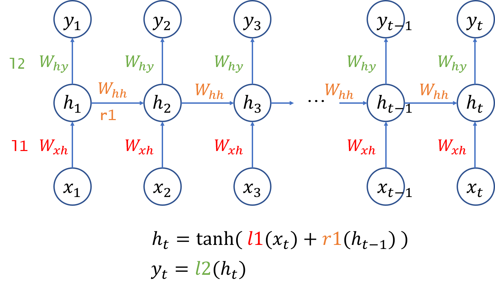
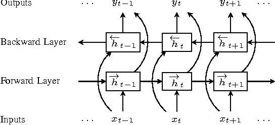
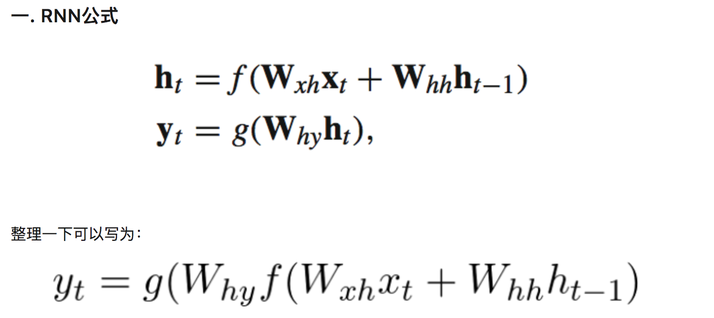
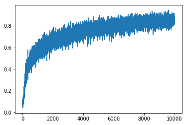

# Bidirection RNN
## 先介紹普通的RNN 
 
## 這是bidirection RNN 
### 1. 論文模型架構圖 
其結構如下: 
 
### 2. 架構特性與概念 
其結構如下: 
  
bidirection RNN 與一般的RNN不太一樣，他是新建兩個不一樣的RNN，然後去將時序型的資料以相反的方向輸入，以達到前後考慮的特性。
### 3. 模型運算邏輯 
普通的RNN是透過當前的資料點加上之前學習的記憶來預測當前的輸出，但是這樣常常遇到幾個問題 
1.你的問題假設是後面的時間序列其實跟前面的時間序列是有高度相關的 
2.你的資料前面的時間點與離當前時間點較近的時間點都很重要的時候 
你會遇到說因為RNN，會去淡忘前面較為前面的輸入，且沒辦法先看到後面的資料來預測，如果你的資料有以上兩種特性就會造成說學習效果不佳。 
因此bidirection RNN相比於單向的RNN，他可以透過雙向的輸入，來確保自己比較不會只仰賴單一方向的時序，而是可以同時考慮，使得效果比較好。 
透過將兩個rnn的輸出做合併（中間可以是相加抑或是相乘看你的case需要怎樣的操作），e.x. y(t) = y(t forward) + y(t backword) 
#### 小總結 
bidirecrion RNN 是一個很相對RNN記憶性比較好的model。 

### 4. 數學解釋 
 
### 5. 閱讀後認為可以發展的方向或心得 
可以用於一前面的資料與後面的資料都對於預測結果有重大影響時使用 

### 6.表現
Data Set: Mnist(經過10000 steps後的準確率)
 

## reference
paper: https://arxiv.org/abs/1602.04874 
RNN example :https://github.com/aymericdamien/TensorFlow-Examples
