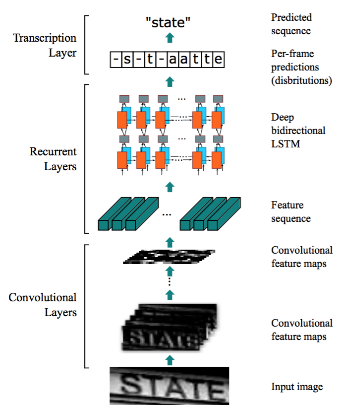
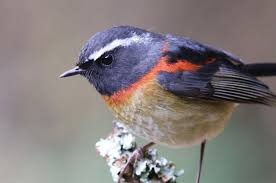

# CRNN
### 1. 論文模型架構圖
其結構如下: 
 
其中cnn 跟 rnn 的結構都可以有不一樣的變化，我使用的結構是兩層cnn兩層pooling + bidirection RNN完成
### 2. 架構特性與概念 
適合解決輸入是圖片，但是輸出卻是序列型資料的問題，舉個例子，假設你希望一個model輸入是圖片，輸出是這張圖片的一段描述 
input :  
 
output : 這是一隻黑白相間的鳥 
這種類型的問題就需要先利用cnn 去提取圖片特徵，然後再透過rnn去輸出一段序列型資料。 
### 3. 模型運算邏輯
模型會先透過conv and pooling去提取圖片特徵，如圖中state的例子，圖片中state是有順序性的，將圖片特徵視為時序型資料的input vector，然後再透過rnn去得到我想要的輸出。 
### 4. 閱讀後認為可以發展的方向或心得
google圖片上常常會需要標注這是什麼東西，可能使用者上傳圖片時並沒有特別寫明，這時候就可以透過這個model去這些圖片標注上一些敘述。

### 5. 結果
Data set: Mnist(經過 10000 steps)
 

## reference
paper: https://arxiv.org/abs/1507.05717 
tensorflow sample code
