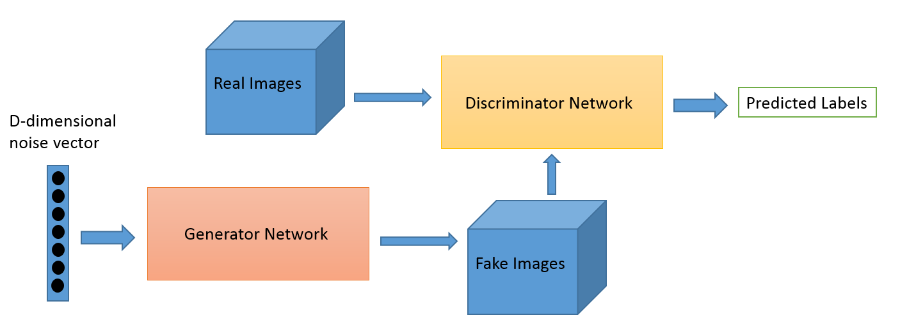
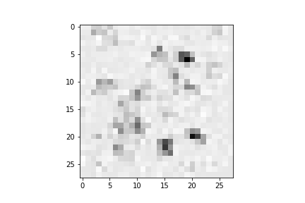

# eazyGan
### 1. 論文模型架構圖
其結構如下: 
 
### 2. 架構特性與概念 
基本上一個標準的Gan 由Discriminator network 另一個是Generator network所組成，Discriminator network的工作是去分辨說他看到的input到底是Generator network所生成的network還是真的圖片，Generator network的目標就是去騙過Discriminator network讓Discriminator network以為說Generator network生成的是真的圖片，透過訓練這兩個model，Discriminator network會越來越懂的分辨真的圖片跟Generator network生成的圖片，然而Generator network越來越會騙Discriminator network讓他以為他生成的圖片是真的，經過幾個迭代以後，可以得到一個生成跟原本data分布很像的Generator network。
### 3. 模型運算邏輯
首先先透過Generator network 隨機生成一些醜醜的圖如以下 
 
然後讓Discriminator network做一個新手訓練，讓他至少分的出來亂七八糟的圖片跟我們data_set的資料是很不一樣的。 
然後再讓fix 住Discriminator network參數，然後開始訓練Generator network，Generator network就會開始越來越會騙，可以騙過Discriminator network，等差不多了再去fix住Generator network參數，然後開始訓練Discriminator network讓他分的出來到底是Generator network生成的圖片還是真的圖片。反復幾個迭代，可以得到一個很厲害的Generator network跟Discriminator network。

### 4. 閱讀後認為可以發展的方向或心得
他可以去生成一些未看過的資料，之前有一個比較極端的應用，是拿來破解deep learning的辨識系統，假設你現在有一個很準的人臉辨識系統好了，我可以透過訓練一個很厲害的Generator network，他可以去騙過這個人臉辨識系統，讓他以為那是另一個人，這是一個非常可怕的事情，阿里巴巴有人臉辨識付錢，你可以想像假設你可以讓辨識系統以為你是另一個人就會有盜刷的問題。

### 5. 結果
Data set: Mnist(經過 10000 steps)
 

## reference
paper: https://arxiv.org/abs/1406.2661 
參考 midum : https://medium.com/@gau820827/%E6%95%99%E9%9B%BB%E8%85%A6%E7%95%AB%E7%95%AB-%E5%88%9D%E5%BF%83%E8%80%85%E7%9A%84%E7%94%9F%E6%88%90%E5%BC%8F%E5%B0%8D%E6%8A%97%E7%B6%B2%E8%B7%AF-gan-%E5%85%A5%E9%96%80%E7%AD%86%E8%A8%98-tensorflow-python3-dfad71662952
