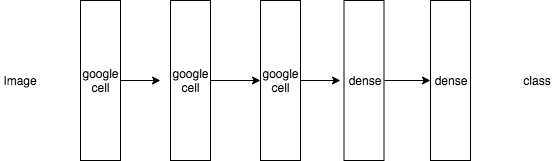

# google_net
### 1. 論文模型架構圖
其結構如下: 
 
google net 是一個 residual net work，一個非常大的神經網路，我沒有那麼多計算資源，所以我這邊沒有實作一整個出來，我實作google cell，以方便日後開發用。 
google net是由許多google cell 組成 
以下是google cell的架構 
 
### 2. 架構特性與概念 
google net 有別於一般的卷積神經網路，它採用兩種的圖像處理的技巧，conv and pooling  
 
透過給定不同的conv 不同的參數，例如說stride的腳步數，製造出大量的filter，然後再把這些filter 全部concat起來，這邊可以理解成他一個pixel一個pixel去看（1x1 conv）再從三個三個pixel(3x3 conv)去看，甚至加上avg pooling，由此可知，google net是一個用各種角度去生成大量的filter，讓機器可以從更全面的角度來理解圖片，會遠比你直接把conv 寫死來的更加的彈性。
### 3. 模型運算邏輯
 
這其中每一個inception可以理解成一個google cell。
我自己實作的版本為 3個google cell + 2層dense
 
本次一樣使用mnist dataset 所以 loss funtion與傳統的交叉商，透過3個google cell 出來的結果，把它攤平之後接兩層dense，所得到的結果經過softmax交叉商。
### 4. 閱讀後認為可以發展的方向或心得
絕大多數的圖片可以先嘗試不使用傳統的conv，可以直接使用google net，他可以直接產生大量的filter，可以不需要為conv的參數做太多的考慮也可以有不錯的結果。相比於傳統的conv。不過參數會指數成長，所以若計算資源不夠的話可能先不要嘗試，或著不要疊太深。
## reference
paper: https://arxiv.org/abs/1409.4842 
tensorflow sample code
